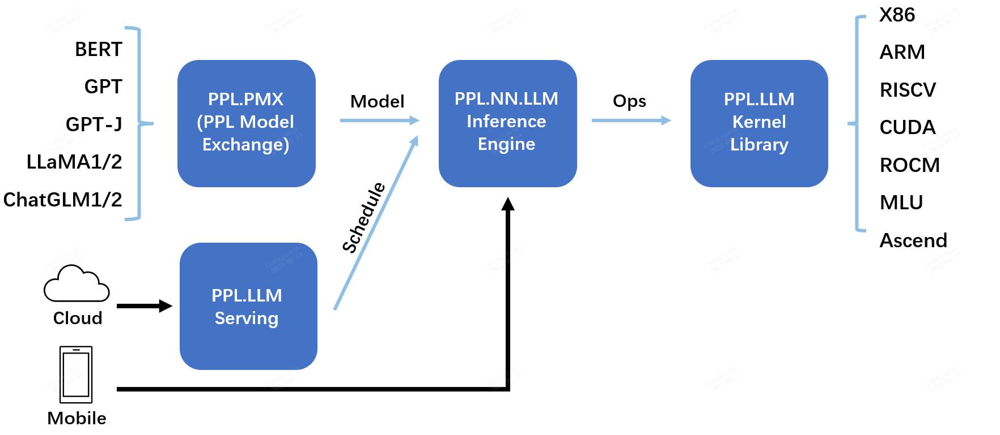

# PPL.LLM

## Overview

`PPL.LLM` is a LLM(Large Language Mode) Inference System provided by OpenPPL.

The system consists of 4 parts:

- `ppl.pmx`: Operator specifications, Model zoo, Model convert, and Model export.
- `ppl.llm.serving`：LLM serving framework, handling user's input and scheduling the model inference engine.
- `ppl.nn.llm`：LLM inference engine, responsible for single step inference of LLMs.
- `ppl.llm.kernel`: Providing optimized LLM operator primitive kernels.

## Platform

Currently tested platform
 - NVIDIA Ampere
 - NVIDIA Hopper

## Quick Start

The tutorials introduced below are independent of each other, you only need to choose one of them to enter.

- [Tutorial for PPL.LLM serving framework](https://github.com/openppl-public/ppl.llm.serving#quick-start): This tutorial covers the process from exporting LLaMA by `ppl.pmx` to launch a LLaMA gRPC server by `ppl.llm.serving`.

- [Tutorial for PPL.LLM inference engine](https://github.com/openppl-public/ppl.nn.llm#quick-start): This tutorial covers the process from exporting LLaMA by `ppl.pmx` to run LLaMA single step inference by `ppl.nn.llm`.

## Introductions

### `ppl.pmx`

`PMX` is a open source format for AI models launched by OpenPPL. It provides a set of standard operator specification documents and the corresponding functional Python API for each operator, making it easy for us to use the `PMX` operator to build the model we need in Python.

At present, it is mainly responsible for the expression of LLM model structure. OpenPPL has established an official LLM model zoo in `ppl.pmx` to provide users with some out-of-the-box open source models. It also provides conversion tools for models from different communities to `PMX` models, tensor parallel splitting tool and merging tool for `PMX` model.

#### Links

- [Github](https://github.com/openppl-public/ppl.pmx)
- [Model Zoo](https://github.com/openppl-public/ppl.pmx/tree/master/model_zoo)
- [Example of testing and exporting meta LLaMA](https://github.com/openppl-public/ppl.pmx/blob/master/model_zoo/llama/facebook/README.md)
- Convert Huggingface LLaMA to PMX LLaMA (Comming soon)
- Tensor Parallel Merging and Splitting (Comming soon)

### `ppl.llm.serving`

`ppl.llm.serving` is a high-performance large model serving framework. It is one of the user interfaces of `PPL.LLM` system and is implemented in C++. `ppl.llm.serving` has been optimized in many aspects for large model serving, such as:
1. Asynchronous optimization. Asynchronous encode and asynchronous decode to reduce the overhead of serving.
2. KV Cache allocation management. Implemented a dedicated memory allocation manager
3. Scheduling optimization. Reduce unnecessary request queue inquiries when the hardware is fully loaded.

#### Links

- [Github](https://github.com/openppl-public/ppl.llm.serving)
- [Launch a LLaMA Text Genarate Server](https://github.com/openppl-public/ppl.llm.serving#quick-start)

### `ppl.nn.llm`

`ppl.nn.llm` is a ​​LLM inference engine based on `ppl.nn`. It is mainly responsible for inferring models in PMX format. And performing a series of optimizations, including memory management, graph optimization, algorithm selection, etc. At the same time, it is a multi-platform framework that supports multiple back-end adaptations, providing the `PMX` model with the ability to extend on heterogeneous platforms.

#### Links

- [Github](https://github.com/openppl-public/ppl.nn.llm)
- [Run LLaMA inference single step](https://github.com/openppl-public/ppl.nn.llm#quick-start)

### `ppl.llm.kernel`

`ppl.llm.kernel` provides LLM inference with extremely optimized primitive kernels on various heterogeneous platforms. It is the core of the acceleration of the entire inference system. We have implemented many optimizations for each LLM operator kernel, including but not limited to multi-threading, instruction optimization, loop unrolling, vectorization, assembly optimization, task distribution planning and other optimization methods to achieve the ultimate performance.

Currently we provide the kernel library of CUDA architecture, and will support more heterogeneous platforms in the future.

#### Links

- [CUDA Kernel Github](https://github.com/openppl-public/ppl.llm.kernel.cuda)
